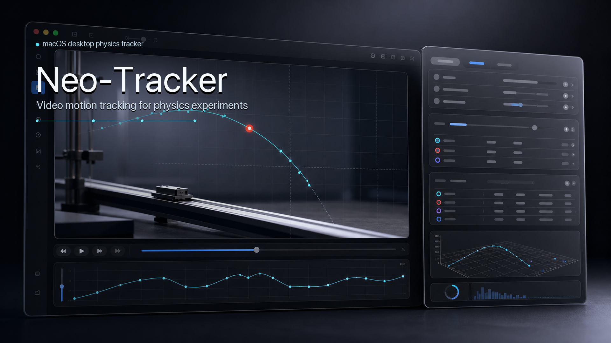

# Neo-Tracker



Neo-Tracker 是一个面向物理实验、IYPT 研究和教学分析的 Python 追踪软件原型。它的目标不是把传统 Tracker 再做一遍，而是把“追踪”拆成可组合、可解释、可调参的物理分析流程。

核心思想很简单：复杂实验不应该靠一个又一个硬编码补丁解决。用户应该能够选择预设，再调整 ROI、坐标映射、观测模型、状态模型、运动约束和滤波策略，让同一套软件适配色块、小球、圆周运动、波前、火焰前沿、沿轨道运动等常见和特殊场景。

## Design Philosophy

传统视频追踪工具常见的问题是：

- UI 和交互偏旧，视频预览、ROI 标定、结果检查不够顺手。
- 追踪目标稍微复杂，例如火焰闪烁、周期跨越、遮挡、亮度突变，就容易脱锁。
- 算法逻辑往往围绕“点坐标”展开，难以自然表达角度、相位、前沿、轮廓或多目标状态。
- 中间过程不可见，用户只能看到最后轨迹，很难判断错误来自 ROI、颜色阈值、坐标映射还是滤波器。

Neo-Tracker 的设计方向是把追踪系统抽象成一条管线：

```text
ROI -> Coordinate Mapping -> Observation Model -> State Model -> Motion Prior -> Optimizer/Filter -> Visualization/Export
```

这意味着“行进火焰”不是一个特殊 if 分支，而是一组模块组合：环形 ROI、极坐标/环形展开、火焰前沿观测、展开角度状态、周期运动约束和稳定滤波。

## Architecture

### ROI

ROI 定义追踪发生的有效区域。当前设计支持：

- 矩形 ROI
- 多边形 ROI
- 圆形 ROI
- 环形 ROI
- 曲线带状 ROI

桌面 UI 已支持矩形、圆形、环形 ROI 拖拽绘制，也支持多边形 ROI 和曲线带状 ROI 逐点绘制。

### Coordinate Mapping

坐标映射负责把图像像素转换成更适合物理问题的坐标空间：

- 平面像素坐标
- 线性定标后的世界坐标
- 极坐标
- 环形展开坐标
- 曲线路径弧长坐标

这个层是 Neo-Tracker 区别于普通点追踪器的关键。一个圆周运动问题不必一直追 `x, y`，可以直接追角度 `theta` 或展开相位。

两点定标杆会计算 `unit_per_pixel`。对于平面点追踪，它会生成线性世界坐标 `x_world/y_world`；对于一维波前/界面追踪，它会把 `x_px/y_px` 标量状态迁移到 `x_world/y_world`，并同步运动约束与滤波键；对于环形和曲线路径坐标，它会把弧长/路径长度的 `unit_per_pixel` 和单位同步到对应 coordinate model，让后续结果、JSON、分析源和报告使用真实长度单位。

### Observation Model

观测模型负责从每一帧里产生候选测量值，而不是直接决定最终轨迹。当前方向包括：

- RGB/HSV 色块响应
- 亮度峰值
- 模板相似度
- 边缘/前沿
- 环形径向前沿
- 响应热图和候选点可视化

把观测和状态估计分开后，软件可以在“看见了什么”和“物理上应该怎么运动”之间做更稳健的融合。

### State Model

状态模型定义真正被追踪的物理量：

- `x-y` 点坐标
- 一维标量位置
- 角度 `theta`
- 展开相位 `theta_unwrapped`
- 前沿位置
- 轮廓状态
- 多目标状态

这让同一个视频可以用不同物理语言分析。例如圆周运动可以输出角度，波前传播可以输出前沿位置，行进火焰可以输出连续展开角度。

### Motion Prior

运动先验表达物理约束：

- 无先验
- 最大速度/加速度限制
- 匀速或近似匀速
- 周期角运动
- 沿路径运动
- 短时丢失后的预测
- 异常跳变判定

这也是解决“脱锁”的核心位置。对行进火焰这类周期系统，追踪器必须理解 `0°/360°` 跨越、方向连续性和短时亮度闪烁，而不是只看当前帧最亮的位置。

### Optimizer / Filter

滤波器和优化器用于平滑、预测和局部修正：

- Pass-through
- 指数平滑
- Alpha-Beta filter
- 网格搜索
- Particle Swarm Optimization, PSO

PSO 在设计中主要用于调参和局部精修，而不是代替整个追踪逻辑。稳定性应优先来自正确的坐标空间、状态模型和运动约束。

## Desktop UI

当前桌面端使用 PySide6。窗口设计围绕实验工作流展开：

- 左侧是视频预览区，支持首帧/指定帧显示、播放控制、ROI 覆盖层。
- 顶部是 macOS 风格的统一工具栏，显示当前媒体、追踪状态、结果摘要，并提供 `Run Tracking`、`Export CSV` 和 `Report` 快捷入口；追踪运行时会显示实时帧进度，并将主按钮切换为可安全取消的 `Cancel`。已有 Results/Edits 时，新的 Full Run 会先列出替换数量并默认保留当前结果，用户必须明确选择 `Run + Replace Results/Edits` 才会覆盖。
- 右侧是 inspector 式分组侧栏：`Media`、`Tracking`、`Review`、`Signal`、`Calib`、`Flow`、`JSON`。
- `Media` 用于添加视频或 WAV 文件、查看 FPS/帧数/分辨率、播放和切换当前帧。多任务项目可在移除前查看该任务的 Results/Edits/Runs 数量，经二次确认后只移除项目条目、不删除磁盘媒体，并可立即撤销恢复同一任务及历史。项目媒体移动或离线时可在当前任务内选择替代文件：类型、核心元数据和已保存 source identity 匹配时保留历史结果；内容摘要或分辨率/FPS/帧数等不一致时明确要求重连并清除结果，视频与音频互换会被拒绝。
- WAV 会作为音频媒体识别，显示采样率、样本数和通道数；视频追踪按钮保持禁用，但 `Signal` 标签页可直接使用 mono 或单独声道做 FFT/STFT。
- `Media` 也提供 `Open Project` / `Save Project`，保存媒体路径、预设、ROI、定标、当前帧、追踪结果和最近 20 次运行审计记录；已 Apply 的内容变化后顶部和 Media 页会持续显示 `Unsaved` / `Unsaved changes`，Save 变为明确主操作。尚未 Apply 的 ROI、定标、Pipeline JSON、媒体替代候选或预览绘制会独立显示全局 `Draft` / `Drafts`，避免把“可保存内容”和“编辑草稿”混为一谈。打开其他项目或关闭窗口前会先列出草稿并提供 `Keep Editing` / `Discard Drafts`，再按需提供 Save / Discard / Cancel；任一步取消都会保留当前内容和可继续操作的窗口。移除最后一个任务后保存会保持显式空项目，不会把临时占位任务写回文件。
- 项目文件 version 2 会保存媒体元信息和 source identity 快照、任务 pipeline 和可选 `pipeline_library`；version 1 顶层 `pipelines` 会自动无损迁移。如果原媒体暂时不可用，UI 仍会显示上下文，并提供先比对、后 Apply 的重连入口；应用新路径后需点击 `Save Project` 才会持久化。旧项目没有 source identity 时继续按元数据兼容读取，并在下次保存时升级。
- `Tracking` 用于选择预设并查看当前 pipeline 模块摘要；Compute backend 状态会明确标出 OpenCV 加速、NumPy 优化路径或较慢回退；仅 Color Marker 等实际使用 Color Blob 的预设显示标记颜色、容差、候选上限和最小区域面积，其他预设会收起整组无关参数并把空间留给当前模块摘要。
- `Review` 用于查看带单位的逐帧结果表、可切换的 Confidence/Velocity/Mismatch/Angular response 诊断图，以及带数量提示的 `Runs` / `Edits` 双历史页；诊断图支持点击或左右方向键同步跳帧，并且只显示当前数据真实提供的模式。运行记录区分 Full/Rerun 与 Complete/Partial/Canceled/Failed，并可筛选、双选比较配置及导出可见记录。编辑历史可按 Corrected/Marked lost/Rerun 筛选，保留任务级原始序号，选中后可跳回对应帧或导出当前筛选结果。用户还可手动修正当前点、标记丢失帧、从当前结果后重跑，并在预览区同步显示滤波轨迹、未滤波测量轨迹、当前点、带编号候选点、运动预测点和图像空间响应热图；环形观测只保留真实的 `polar_samples` 与轻量 `theta_signal`，Response 会直接路由到下方 Angular response 并显示采样数，不再为旧帧解码/重算一张重复的极坐标矩阵，即使源媒体不可用也能查看已保存的角向证据。其他历史图像空间响应仍在后台重算，期间显示 `Loading` 且不沿用上一帧热图；选中结果卡会明确显示目标 frame/time/status/confidence/state，候选与响应诊断在手动编辑后会标为原始 `pre-edit evidence`。
- `Signal` 在后台线程按块解码 WAV 到单一 mono/指定声道输出，不再同时长期保留完整原始 PCM 与全通道 `float64`。Tracking 选中序列也只在主线程冻结一个不可变结果引用快照，随后在 worker 构建数值数组。运行按钮会切换为可取消状态，状态条明确区分 `Loading WAV…`、`Preparing N samples…`（Stage 1 of 2）和真正的 `FFT/STFT running…`（Stage 2 of 2）；任务/数据源/参数变化会丢弃过期结果。长信号会在读取前估算峰值工作集，超过 768 MiB 安全阈值时给出缩短、降采样或降低 overlap 的提示。FFT 只显示当前会生效的参数；切换到 STFT 时窗口大小和 overlap 原位恢复，不再用禁用的无关字段压缩结果区。
- `Calib` 用于 ROI 和定标信息。矩形、圆形、环形可直接精确编辑像素几何；多边形和曲线带可在节点表中修改、删除节点，或在选中节点后的线段中点插入新节点，曲线带同时可编辑半宽；顶部 ROI 摘要使用与编辑器一致的 `nodes`、`px` 和 `half-width` 术语，新建控件也明确标为 `New curve half-width`。画布节点支持拖动及方向键 1 px 微调，按住 Shift 时步进 10 px；单击只选择节点，不会产生坐标漂移。所有 ROI 修改先进入可撤销的草稿，点击 `Apply Geometry` 后才统一校验并使旧结果失效；绘制新 ROI 时编辑器会锁定，`Finish Drawing` / `Cancel Drawing` 只在真实绘制状态可用。标记两点定标杆后会进入独立草稿，可直接编辑真实长度和 `mm` / `cm` / `m` / `in` 或短自定义单位，并显式 Apply/Revert；已应用的定标也可不重画端点直接修正，只有 Apply 才更新任务、坐标模型并使旧结果失效。
- 未定标时，Calib 的 `Scale` 使用 `Path distance · px`、`Position · px`、`Angle · rad` 或 `Area · px²` 等用户可读物理量，不再直接暴露 `s`、`x_px`、`theta` 等内部状态键；应用两点定标后仍显示精确的 `1 px = … unit`。
- `Flow` 用文字展示当前追踪流程每一步的模块。
- `JSON` 显示并编辑当前 pipeline JSON，可校验、应用或重置视图，主要用于开发调试和复现实验。

视觉层参考了几类开源/平台设计：

- [iina/iina](https://github.com/iina/iina)：macOS-first 视频播放器，启发 Neo-Tracker 采用内容优先的预览区、轻量工具栏和独立音频/视频状态表达。
- [napari/napari](https://github.com/napari/napari)：Qt 科学 viewer，启发右侧 inspector 保留密集参数、图层/叠加开关和可分析数据表。
- [ColinDuquesnoy/QDarkStyleSheet](https://github.com/ColinDuquesnoy/QDarkStyleSheet)：Qt 主题框架，启发 Neo-Tracker 把字体、颜色、圆角、表格和控件状态集中到一套 QSS token。
- Apple Human Interface Guidelines：侧栏、工具栏和字体层级向 macOS 原生软件靠拢，避免默认 Qt 控件的“工程样机感”。

## GitHub Reference Notes

本项目参考了一些已有开源工具的工作流设计，但不会直接照搬它们的代码或产品边界：

- [OpenSourcePhysics/tracker](https://github.com/OpenSourcePhysics/tracker)：说明教学物理软件必须把视频分析和物理建模放在一起，而不是只输出像素点。
- [Kinovea/Kinovea](https://github.com/Kinovea/Kinovea)：强调视频检查、慢放、标注、测量是同一个工作流的一部分。
- [FastTrackOrg/FastTrack](https://github.com/FastTrackOrg/FastTrack)：自动追踪后仍需要快速人工 review/correct，追踪软件不能只相信算法。
- [soft-matter/trackpy](https://github.com/soft-matter/trackpy)：粒子追踪应有清晰的 Python API、教程和可复现实验流程。
- [DeepLabCut/DeepLabCut](https://github.com/DeepLabCut/DeepLabCut)：复杂追踪工具应同时提供 GUI 和 API，并给普通用户合理默认值。
- [cvat-ai/cvat](https://github.com/cvat-ai/cvat)：成熟视觉工具会把视频/图像标注、AI 辅助、导出格式和开发者 API 作为长期基础设施。

因此 Neo-Tracker 的改进路线会优先补齐三类能力：

- 可解释交互：ROI、定标杆、坐标轴、响应热图、候选点和滤波轨迹都应该可见。
- 可纠错追踪：自动追踪结果需要人工校正入口，并保存每次修正的来源。
- 可复现实验：pipeline JSON、参数预设、导出表格和分析图要能完整复现一次实验；JSON 面板应用配置时会严格校验，避免无效模块悄悄回退到默认值。

## Signal Processing

Neo-Tracker 内置后处理分析层，用于对追踪结果或音频波形做频谱分析：

- FFT 使用 NumPy 实现。
- STFT 优先使用 SciPy。
- 支持追踪结果时间序列，例如 `x_px`、`y_px`、`theta`、`theta_unwrapped`，并在桌面端显示定标后的单位。
- 支持 PCM WAV 音频，第一版不承诺 MP3/M4A。
- 多通道 WAV 会在桌面端暴露 mono mix 和各个单独声道。
- 支持导出 CSV 和 NPZ，导出结果保留数据源名称、单位和分析元数据。
- Signal 数据源列表直接显示有限样本数、源采样率和单位；追踪结果用一次 metadata pass 发现全部 state/velocity 信号，并缓存紧凑来源索引供未变化任务重绘复用。详情区和 Refresh action 显示 `N tracking signals indexed from M results`；显式 Refresh 总是完整重扫并在状态栏确认，内部人工编辑/追踪终态会主动失效缓存。真正运行 FFT/STFT 时才构建选中序列。若有 missing/non-finite time 或 value，详情会明确显示 usable/total/omitted，并在 tooltip/accessibility copy 解释原因。选中序列在主线程冻结不可变引用快照、复用已发现采样率，再由 worker 构建数值数组；全有限数组不再重复 slice，稀疏数据继续使用原 finite-mask copies。运行期间会锁定可能替换或原位修改 Results 的 Tracking/Review 动作，完成/取消后恢复。采样率 override 默认保持 `infer`，不会因选择数据源而悄悄变成显式覆盖。
- FFT/STFT 结果绑定当前任务与数据源；重新追踪、切换任务/信号、手动修正或更改参数后旧结果会失效并关闭导出。
- 频率范围倒置、无有效频率 bin 或非法 STFT overlap 会显示明确失败状态，不会静默导出空结果。

桌面端入口是右侧 `Signal` 标签页。它的设计目标类似 Origin Pro 的轻量分析面板：先选数据源，再选 FFT/STFT，再设置窗函数、去趋势、采样率和频率范围。

## Example Presets

### Color Marker

适合常规色块、小球、标记点追踪。

```text
Rectangular ROI -> Image Coordinates -> Color Blob -> XY State -> Bounded Velocity -> Alpha-Beta Filter
```

### Circular Motion

适合圆周运动、转盘、摆动角度分析。

```text
Circular ROI -> Polar Coordinates -> Color/Brightness Observation -> Angle State -> Periodic Prior
```

### Travelling Flame

适合环形槽中周期行进的小火焰、亮斑或前沿。

```text
Annular ROI -> Annular Mapping -> Fire/Front Response -> Unwrapped Angle -> Periodic Angular Prior
```

这个预设的重点不是“火焰补丁”，而是对一类周期前沿问题的通用表达。

### Wave / Interface Front

适合水波波峰、界面传播、绳波包络等。

```text
Band/Rectangular ROI -> Image Coordinates -> Edge/Gradient Front -> Scalar Front State
```

两点定标后，前沿标量会从 `x_px/y_px` 切换为 `x_world/y_world`，运动速度阈值也会按比例尺转换，避免“UI 显示已定标但追踪状态仍是像素”的误差。

### Path Motion

适合沿曲线轨道运动的小球、滑块或亮点。

```text
Curve Band ROI -> Arc-Length Coordinates -> Brightness/Template Observation -> Path Position
```

## Current Implementation

当前代码已经包含：

- 核心 tracking pipeline 抽象
- 多种 ROI、坐标、观测、状态、运动先验、滤波器和优化器
- 预设注册系统
- 可选 OpenCV 媒体读取层
- WAV 音频媒体探测不依赖 OpenCV，可直接进入信号处理工作流
- PySide6 桌面窗口
- 视频预览、播放控制、矩形/圆形/环形/多边形/曲线带状 ROI 标记、预设 ROI 重置、两点定标杆、点/波前/路径单位定标和定标重置
- 预览播放按源 FPS 与 elapsed wall time 映射目标帧，不再因慢渲染按 timer 次数累积慢放；低帧率保持真实间隔，落后时只跳过 preview display frame，并以 `Playing · … fps · Preview skips …` 明示追帧状态。解码失败会立即停止并显示 `Playback stopped · Frame … unreadable`、恢复 Play 和选择其他帧/重连指引；完整错误进入 tooltip/无障碍描述，Tracking results/source data 不会改变
- 生产视频探测和 Preview 解码都在可终止的 `spawn` helper 中运行；同一媒体复用一个持久 `MediaReader` session，并通过受限 JSON header + 原始 `uint8` bytes 传帧。IPC 在数组构造前执行 16,777,216 像素/48 MiB 上限、尺寸与来源版本/identity 复验；取消、超时、崩溃、媒体切换和过期结果会关闭 session，不会把 native decoder 故障带回 GUI 进程
- 五类 ROI 的上下文数值编辑：简单几何使用带单位字段，Polygon/Curve Band 使用节点表和合法最小节点数保护；Calib 画布会显示可命中的节点手柄，表格行与画布节点双向选择，支持选中段中点插入、拖动和 1/10 px 键盘微调。所有操作只更新蓝色草稿并保留绿色 applied 基线，仍需 Apply/Revert；coordinate model、Advanced JSON 和项目保存保持同步
- 两点定标的非模态草稿编辑：端点、像素长度、真实长度和单位同时可见，支持 `mm` / `cm` / `m` / `in` 与短自定义单位、Apply/Revert、应用后不重画直接修正；任务、旧结果和世界坐标只在 Apply 后改变
- 离线项目媒体恢复：替代文件先与保存的音视频类型、分辨率/FPS/帧数或采样率/样本数/声道数以及 source identity 比较；验证匹配时显示 `Source verified` 并保留结果，不匹配时用 `Relink + Clear Results/Edits` 明示破坏性后果并保留 Runs 审计。结果为空但仍有 Edits/outcome/note 时也会进入清理保护，完整路径保留在 tooltip/无障碍描述中
- 色块标记颜色采样、容差、候选上限和最小区域面积调节，参数会写入 pipeline JSON 和项目文件
- Color/Brightness 观测按 8 连通区域输出 top-k 候选，不再把多个目标合并成一个中点；ROI 边界小于整帧时，颜色/亮度转换与连通域只在边界窗口内执行，再把候选和完整响应图还原到全帧坐标；运动先验会从候选中选择时间上最一致的目标
- 可编辑 JSON 面板，支持校验、应用当前 pipeline 配置，并根据 `metadata.preset` 自动切换对应预设；非法 ROI 会显示不截断、可换行且带无障碍说明的错误提示条
- 从当前视频、ROI 和 pipeline 直接运行逐帧追踪。内置 pipeline 的 reader、严格一帧预取和计算在 `spawn` 子进程中执行，`QThread` 只监控 IPC；取消宽限为 0.35 秒，之后有界 terminate/kill，结果每 16 帧 checkpoint，因此 native decoder 不返回也不会无限拖住窗口。隔离能力不足时默认 fail-closed；只有显式兼容路径可选择线程执行。运行前、子进程启动前和终态提交前都会重验媒体身份；来源漂移会丢弃本轮新结果、恢复旧 Results/Edits/outcome/analysis，并隔离新媒体直到用户确认 Relink。运行中显示吞吐、ETA、Input/Compute 与 Review cache，终态把 runtime backend、性能和 source provenance 写入有界 Runs，并可在列表、比较、CSV、报告和项目重开后审计
- 预览画布、ROI/定标交互、追踪叠加、Review 表格/编辑状态、置信度时间线、项目任务状态转换和 Signal processing 使用独立组件、控制器与后台 worker，主窗口负责工作流编排
- 视频声明帧数大于实际可解码帧数时，后台任务会保留已完成结果并进入 `Partial` Review 状态；该 outcome 与提前结束原因会随项目保存，重开后即使媒体离线也不会退化成普通 `Tracked`
- `run(reset=False)` 会从已有结果后连续编号和计时；连续丢帧时会保留滤波速度并持续外推，而不是只预测一帧后停住
- Review 表格、带单位的选中结果状态卡、置信度曲线、运行/编辑双历史页、滤波/未滤波轨迹叠加、当前点/观测点/候选点/预测点显示、响应热图、手动点修正、丢失帧标记和从修正点后继续重跑；Velocity 诊断的 series 下拉直接显示 `v_x_px (px/s)` 等单位化名称，同时保留内部 key 供状态、导出与持久化使用；`Rerun After…` 会先列出被替换的后续 Results 和受影响人工修订，默认保留当前尾段，提交后保留早期锚点并把被覆盖修订灰显为可导出的 superseded 历史；运行历史可按四类结局筛选、显示每次 runtime Compute backend、吞吐/Input/Compute/Review cache peak、双选比较元数据/性能和逐路径 pipeline 配置差异，并把当前可见记录以保留原序号的 CSV 导出；结果刷新、重跑终态和时间轴移动会保持表格、状态卡、诊断与预览作用目标一致
- 大规模 Review 的模式发现、frame lookup、velocity key 与证据可用性合并为一次索引；Velocity/Mismatch 静态序列使用最多两项的 LRU，重复切换只重绘。Results、ROI 节点和运行比较三类表格均由 Qt C++ 工厂创建原生 view/widget，避免 macOS Accessibility 重入 PySide table wrapper 的已观测原生崩溃边界；表格内容、选择和完整虚拟 Results 模型保持不变
- 重型响应图和二维调试层同时受最近 4 个结果帧与默认 64 MiB payload target 约束；Color/Brightness/Template/EdgeFront 在后台 Tracking 中只保留 ROI/search window 的精确响应与全局 placement，用户查看时才展开为只读全尺寸图并进入全局 4 项 Review LRU，直接 observation API 仍返回完整 response。旧帧缺少已存证据时会在 QThread 后台按需重算，快速切帧只接纳最新 owner/pipeline/result/frame token；状态条会标明 Loading/Stored/Cached/Recomputed 来源；环形分析的一维 `theta_signal` 仍完整保留
- `.ntproj` version 2 以同目录临时文件、flush/fsync 和 `os.replace` 原子保存；UI 保存使用不可变快照在后台完成，保存期间继续编辑会保持 Unsaved。生产打开由 subprocess 读取/迁移 JSON，再以有 digest、顺序和数量清单的受限 JSONL 流式重建，成功后才原子切换；项目文件上限 64 MiB，项目结果总量上限 100,000。加载覆盖媒体路径、预设、ROI、标定、帧位置、pipeline library、notes、结果与最近 20 次 Full/Rerun
- 项目加载会校验格式版本，并要求文件中明确提供的 pipeline 字段精确应用；五类 ROI 同时校验有限坐标、正尺寸和半径顺序，损坏配置不再静默回退到预设
- 项目任务会先完整构建和验证再替换当前窗口；坏项目加载失败后会保留原任务，任务列表信号不会被锁死。同一路径媒体若与项目保存的核心元数据或 source identity 不同，会先以 `Source changed` 阻断 Preview、结果编辑/重跑和导出，并把当前文件作为待审核 Relink 候选；旧 Results/Edits 在用户明确 Apply 前不会被改写
- 未 Apply 的 ROI、定标、Pipeline JSON、媒体替代候选和预览选择会以独立 Draft 状态持续显示；Open/Close、task/preset 切换、scratch 媒体替换、task 移除与撤销都会在替换编辑上下文前提供 `Keep Editing` / `Discard Drafts`，取消时恢复原选择并完整保留草稿。向已有项目添加新 task 不再重绘当前编辑器，因此不会丢失当前草稿
- 项目文件会保留尺寸受控的一维环形 `theta_signal`，往返加载后仍可生成时间-角度热图；二维重型响应数组继续省略
- Travelling Flame 先收集配置的 radii×angles 环形像素，再只在这组样本上计算融合 Fire 或亮度响应；默认 24×720 网格为 17,280 点，仅占 1080p/4K 像素的 0.833%/0.208%。1080p Fire/brightness 由 3.653/3.344 ms 降至 0.414/0.437 ms（8.827×/7.654×），4K 由 17.051/14.515 ms 降至 0.373/0.376 ms（45.695×/38.645×），Python 可见峰值下降 95.247%–98.860%；随机帧角度信号误差不超过 9.88e-7，峰值、候选状态/坐标/分数完全一致。ROI 外未采样像素不再改变保留的 `polar_samples`；仓库 72 帧视频 peak/candidate mismatch 为 0、观测约 1.494×。稳定帧尺寸/ROI/映射会复用单项只读采样几何与展平像素索引；常见负通道 stride uint8 RGB 不再先复制一块 `radii×angles×RGB` 样本。默认 24×720 完整 Fire/brightness 观测由 0.3397/0.3221 降至 0.0951/0.0783 ms（3.572×/4.116×），128×2048 由 4.4161/4.5718 降至 0.9921/0.8783 ms（4.451×/5.205×），polar/theta/candidate 完全一致；非连续空间视图与非 uint8 全帧缩放语义保留兼容路径。Tracking 页显示 `NumPy cached linear fire`/`NumPy cached linear intensity`；可用 `python3 benchmarks/benchmark_annular_linear_sampling.py --rounds 40` 重测。融合 RGB 权重、单次归一化 reduction 与常量帧原位清零仍在紧凑样本路径内使用。模板 NCC 在 OpenCV 可用时走 `matchTemplate` 快速路径，否则小问题直接计算、大问题使用 64 MiB 软工作集的有界块 FFT NCC；常量模板和零方差搜索窗口都返回 0.5 中性分数。常见 uint8 视频只把 ROI 搜索窗口及模板 halo 转为亮度，仍返回完整 response 和全局候选；约 46%–47% 搜索源的 1080p/4K 同机中位数约提升 1.073×/1.100×，Python 可见峰值下降 15.759%/16.217%，响应和候选完全一致。可用 `python3 benchmarks/benchmark_template_roi_window.py --width 1920 --height 1080 --rounds 12` 重测
- Template 观测会按模板内容复用只读亮度、零均值统计和能量；公开模板数组被替换、改形状或原地改像素时自动失效。NumPy 大搜索还复用当前几何的只读 FFT 核，小搜索保持直接 NCC。1920×1080 OpenCV synthetic 由 29.246 降至 28.150 ms（1.039×），960×540 强制 NumPy 由 14.870 降至 11.206 ms（1.327×），两组 response/候选完全一致；Tracking 显示 `OpenCV cached NCC` 或 `NumPy cached NCC`。可用 `python3 benchmarks/benchmark_template_cache.py --backend opencv` 与 `--backend numpy` 重测
- Color/Brightness 多候选连通域在 OpenCV 可用时自动走高分辨率快速路径；NumPy 回退对满帧单区域走快捷路径，对大量稀疏 run 向量化聚合后只构造 top-k 候选，与 OpenCV 保持排序、质心、面积和置信度语义一致
- Color Marker 的常见 uint8 视频路径用两个二维 float 工作平面计算 RGB 距离，不再重复创建三通道全帧临时数组；仓库 640×360 实验视频在本机从 178.4 提升至 445.8 fps，1080p 诊断的 input/compute 分别降至约 1.23/18.24 ms 每帧。结果是同机基准，不是跨平台性能承诺；可用 `python3 benchmarks/benchmark_tracking_ingest.py` 重测
- OpenCV 连通域在阈值 mask 不超过 25% active 时只聚合 active labels/response，不再为稀疏候选创建整帧 float64 response；更稠密的非满帧输入继续使用原有 dense scan。真实衍生 1080p/4K 稀疏帧的候选阶段分别约 3.075×/3.014×，Python 可见峰值均下降约 75.48%，候选数值与 area/bbox 完全一致；完整 Tracking 吞吐相对优化前在 640×360/1080p/4K 分别约 1.834×/1.757×/1.142×。可用 `python3 benchmarks/benchmark_component_weights.py <video>` 重测
- Tracking input 默认只预取一张额外解码帧，并以 semaphore 保证内存上界；同机 warm-process 完整运行中，仓库 640×360 视频吞吐提升 1.069×，临时 H.264 1080p 提升 1.089×，临时 H.264 4K 提升 1.069×，结果/状态均与串行路径一致。最大额外解码帧分别为 0.66/5.93/23.73 MiB；可用 `python3 benchmarks/benchmark_tracking_prefetch.py <video> --rounds N` 重测，完整边界见 `artifacts/performance-2026-07-14/tracking-input-prefetch.md`
- 内置 TrackingPipeline 的解码与追踪运行在可终止的 spawn 子进程。child 无 terminal 崩溃/EOF、multiprocessing setup 失败和预取消均有唯一有界终态；capability check 生成的精确 child-input bytes 会直接交给 spawn，不再第二次遍历序列化 rerun prefix。100,000-result prefix 的一次准备为 0.390 秒、10.273 MiB payload、36.958 MiB Python 可见峰值；full/rerun 与线程参考结果一致
- VideoReader 不再信任 `CAP_PROP_POS_FRAMES` 的请求本身：随机 seek 会检查 `set()` 结果与实际落点，落后时精确 `grab()` 补齐，拒绝、越过或补齐失败时重开 decoder 并从头顺序恢复；无法到达才明确抛出 `EndOfMediaError`，不会把当前位置帧标成目标帧
- Tracking 进度保留首项与精确终态，中间更新限制为每 50 ms 至多一次；仓库 640×360/72 帧视频的事件由 72 降至 2（-97.222%），同轮完整耗时 41.046→40.679 ms（1.009×），filtered state/status 完全一致。确定性近零成本 adapter 为 0.282→0.067 ms（4.199×），仅用于说明过量事件的下界成本，不外推为真实采集吞吐；可用 `python3 benchmarks/benchmark_tracking_progress_cadence.py` 重测，边界见 `artifacts/performance-2026-07-16/tracking-progress-cadence.md`
- Brightness、Edge、Template 与环形前沿共用的 uint8 RGB→亮度路径按通道累加到一个输出平面并复用一个 scratch 平面，不再先创建三通道 float32 帧；本机 1080p/20 次中位数从 15.013 降至 2.768 ms（5.425×），Python 可见峰值由 49,767,056 降至 16,589,240 bytes（-66.666%），与旧公式最大绝对误差 1.79e-7。可用 `python3 benchmarks/benchmark_intensity_preprocessing.py --width 1920 --height 1080 --rounds 20` 重测
- EdgeFront 只计算配置的 `x` 或 `y` 梯度轴，正交坐标使用所选前沿线的响应加权中心；后台采集进一步只转换 applied ROI 与梯度轴一像素 halo，并在 ROI 内归一化，ROI 外强边缘不再压制目标。直接 observation API 仍重建完整 response，Tracking history 保留带 placement 的局部 response。约 20% 像素面积的 Rectangle 中，1080p x/y 由 26.041/21.569 ms 降至 5.311/3.566 ms（4.904×/6.049×），4K 由 59.226/58.399 ms 降至 8.814/7.965 ms（6.720×/7.332×），Python 可见峰值下降 69.564%–69.909%，展开 response 最大误差为 0；Tracking 页显示 `NumPy ROI gradient` 与 ROI 归一化说明。可用 `python3 benchmarks/benchmark_edge_front_roi_window.py --width 3840 --height 2160 --rounds 12 --axis x --roi-ratio 0.4472135955` 重测
- Review 播放热路径缓存静态轨迹/measurement 几何、对有序结果做二分帧定位，在静态诊断图上只更新选中标记/状态，并且导航时不再重算与帧无关的 Tracking 汇总；20,000 结果同机诊断中重复 overlay 从 3.467 降至 0.0024 ms、诊断选帧从 5.011 降至 0.0040 ms、完整 preview change 从 1.422 降至 0.211 ms。可用 `python3 benchmarks/benchmark_preview_playback.py` 重测
- Response 叠加层在一次语义 handoff 后只着色一次并缓存拥有数据的 RGBA `QImage`；高分辨率结果保留完整 response 数据，但 Preview cache 只按 fitted display rect × device pixel ratio 构建。4K response 在 865×731 画布的冷 handoff 由全分辨率 40.957 降至 11.271 ms（3.634×），Python 可见峰值由 99,533,980 降至 6,741,604 bytes（-93.227%），重复 repaint 约 0.463 ms/312 bytes；1440×910 前后截图 PSNR 57.593 dB、SSIM 0.999878。可用 `QT_QPA_PLATFORM=offscreen python3 benchmarks/benchmark_response_overlay.py --width 3840 --height 2160 --rounds 12 --canvas-width 865 --canvas-height 731` 重测
- Tracking 重型 Review 数据在保留帧数外增加 64 MiB 字节目标，live performance chip 显示当前 cache，Runs 只持久化一个 peak scalar。4K/6 帧/9 次同机基准中，默认四帧留存由 132,710,400 降至 66,355,200 bytes（-50%），Python 可见峰值由 199,069,956 降至 132,714,532 bytes（-33.333%）；1080p 仍保留原四帧。可用 `python3 benchmarks/benchmark_debug_retention.py --width 3840 --height 2160 --frames 6 --rounds 9` 重测
- 重型 Review history 的逐帧 append/usage 现在维护增量字节与 owner 计数；只有结果列表替换、配置变化或 byte budget overflow 才执行有界重选，精确保留旧有反向贪心语义。`debug_history_limit == frames` 的 1,000/2,000/4,000 帧合成压力中，当前路径为 0.003093/0.006255/0.012525 秒，旧逐帧双重全窗扫描参考为 0.417493/1.672042/6.717723 秒，usage 完全一致。可用 `python3 benchmarks/benchmark_debug_history_scaling.py --frames 1000 2000 4000 --rounds 3` 重测；记录见 `artifacts/performance-2026-07-16/compact-color-window-debug-history-and-live-feedback.md`
- Color/Brightness 在响应平面内直接应用缓存 ROI mask；Brightness 的亮/暗极性、percentile 归一化、clip 和 ROI 也不再逐步生成全帧副本。1920×1080/20 次同机 warm-process 基准中，Color、Brightness、Dark Brightness 分别为 1.206×、1.188×、1.103×，后两者 Python 可见峰值均下降约 33.334%，三者与旧 copy-based 公式的响应误差均为 0。可用 `python3 benchmarks/benchmark_observation_roi_memory.py --width 1920 --height 1080 --rounds 20` 重测
- 当 ROI 边界约占画面 44.5% 时，Color/Brightness/Dark Brightness 只在该窗口完成预处理和连通域；直接 observation 调用再重建完整 response，后台 Tracking 采用下一条的局部历史存储。1080p 同机中位数相对上一版全帧计算为 2.071×/1.488×/1.735×，4K 为 1.955×/1.651×/1.611×，Python 可见峰值下降 27.725%–35.789%，响应和候选元数据完全一致。可用 `python3 benchmarks/benchmark_observation_roi_window.py --width 1920 --height 1080 --rounds 24` 重测
- 在 20% ROI、每轮 6 帧的 Tracking history 诊断中，ROI-local response 使 1080p Color/Brightness 分别约提升 1.386×/1.206×、Python 可见峰值下降 75.835%/72.959%；4K 分别约提升 1.267×/1.232×、峰值下降 60.836%/56.173%。4K 保留量由两张完整 response 的 66,355,200 bytes 降为四张局部 response 的 26,583,952 bytes；按需展开后的 response 最大误差为 0，filtered state/status 完全一致。可用 `python3 benchmarks/benchmark_compact_response_history.py --width 3840 --height 2160 --frames 6 --rounds 5` 重测
- 临时生成的 1080p/30 fps 和 4K/30 fps 素材已覆盖顺序读取、gap/grab、seek、QImage/Pixmap 画布更新和 10 ms GUI heartbeat；两次整窗播放在测量边界均保持在源时间一帧内，当前没有证据支持牺牲图像所有权安全去移除 QImage copy。可用 `python3 benchmarks/benchmark_preview_media.py` 重测
- 大型项目的 Saved/Unsaved 判断继续使用完整 canonical state 并支持“改回原值即恢复 Saved”，比较值改为 64 字符的确定性 SHA-256 fingerprint；纯 task/header 重绘会复用最近一次精确结果。20,000 results 同机状态重绘从约 83.128 降至 0.169 ms，设为 clean 也由两次完整序列化收敛为一次。可用 `python3 benchmarks/benchmark_project_state.py` 重测
- 媒体 source identity 对不超过 768 KiB 的文件计算完整 SHA-256，对更大文件只读取固定的开头/中段/结尾各 256 KiB；仓库 96,073-byte 视频完整摘要约 0.052 ms，虚拟 4 GiB 文件的 768 KiB 采样摘要约 0.291 ms。两者均为本机 warm-cache 诊断，不代表冷盘或网络卷性能；可用 `python3 benchmarks/benchmark_media_identity.py` 重测
- metadata 与 digest 读取受同一 `(device, inode, size, mtime, ctime)` 文件版本 guard 保护；探测期间发生替换时返回不可用而不是拼接两个版本。旧项目没有 digest 且已有历史结果时，即使实时候选有新 digest，也必须以 `Source identity unverified` 显式清理后才能 Relink
- Add Media 与交互式 Open Project 的媒体 metadata/source identity 核验在可取消的 QThread worker 中按序执行，整批完成后才原子写入任务；项目打开会对重复路径只核验一次，并在等待期间保留当前项目可见、暂停修改动作。12 个每项 25 ms 的确定性慢源中，Add/Open 的 GUI 调用返回由 344.523/361.141 ms 降至 2.398/2.118 ms，最大 5 ms heartbeat 间隔由 344.881/361.475 ms 降至 5.666/19.919 ms，结果 digest 完全一致；40 个 task 共用一个本地 source 的项目打开由 30.938 降至 10.112 ms。可用 `QT_QPA_PLATFORM=offscreen python3 benchmarks/benchmark_media_probe_ui.py --slow-count 12 --delay-ms 25 --real-count 40` 重测，边界见 `artifacts/performance-2026-07-16/media-probe-and-project-open-heartbeat.md`
- 交互式 Open Project 的 JSON 读取/迁移位于可终止 subprocess，父进程 QThread 再按受限 JSONL 逐条重建并分阶段准备 Review、Analysis 与 saved-baseline fingerprint；GUI 只在完整成功后原子应用。fingerprint 直接按 canonical records 流式计算，不再保留第二份项目大小的结果字典图；长扫描每 32 条检查取消并短暂让出 GIL，临界区只推迟高代 GC 且在所有终态恢复原阈值。大型旧任务在提交后逐项释放，避免与新工作区应用叠在同一帧。100,000 results / 44.398 MiB 在同一窗口连续三次后台打开的完整可用时间为 5.899/3.850/3.752 s，最大 heartbeat 为 35.00/47.63/53.57 ms，GUI apply 为 32.73/43.95/51.28 ms；同步参考约 1.870 s / 1,873.94 ms，最终 payload/results/fingerprint 与 diagnostics/analysis 完全一致。可用 `QT_QPA_PLATFORM=offscreen python3 benchmarks/benchmark_project_open_ui.py --results 100000 --repeat-background 3 --max-heartbeat-ms 75` 重测；边界见 `artifacts/performance-2026-07-22/project-open-100k-repeat3.md`
- Full Run 替换保护只在 worker 启动前做一次浅层 result 指针备份，并在首个进度后释放，不进入逐帧采集/追踪循环；Rerun 只在确认和首次提交时各线性扫描一次 edit history。20,000 results 与 20 edits 的本机诊断中备份约 0.044 ms、确认/提交扫描约 0.0025/0.0031 ms、指针列表约 160 KiB；100,000 edits 压力诊断的两次扫描约 12.29/14.76 ms。可用 `python3 benchmarks/benchmark_result_replacement.py` 重测
- 静态 ROI mask 按 ROI 配置和帧形状缓存并以只读数组复用；首次构建也改用 `numpy.ogrid` 广播行/列坐标，不再先分配两张全帧 `int64` 网格。Curve Band 进一步把每条线段的距离计算限制到其扩展包围盒，再合并为同一完整 mask；相对上一版全帧广播路径，1080p/4K 冷构建约提升 6.989×/8.025×，Python 可见峰值下降 83.796%/83.848%，并与旧公式逐元素完全一致。稳态逐帧追踪仍命中原有缓存，不把冷构建结果误报为逐帧收益；可用 `python3 benchmarks/benchmark_curve_band_mask_bounds.py --width 3840 --height 2160 --rounds 4` 重测
- Rectangle、Circle、Annulus 与 Polygon 也只在各自裁到帧内的几何包围盒中执行精确判断，同时保留完整只读 mask。相对上一版全帧广播路径，4K 冷构建分别约提升 1.700×/4.793×/5.144×/2.079×，Python 可见峰值下降 19.828%/67.200%/68.311%/28.002%，画面外和分数几何仍逐元素一致；可用 `python3 benchmarks/benchmark_roi_mask_bounds.py --width 3840 --height 2160 --rounds 5` 重测
- Markdown 实验报告导出，包含媒体信息、ROI/标定、状态单位、结果统计、滤波偏移、异常帧、运行历史、编辑历史、结果预览、当前 pipeline JSON，以及与当前配置不同的历史 pipeline 快照
- 桌面端 tracking CSV 导出会把状态单位写入表头，例如 `x_world (cm)`，避免离开软件后丢失单位语义
- FFT/STFT 信号分析层；200 万帧双声道 16-bit WAV 上，分块解码的 mono/指定声道 Python 可见峰值分别由 84.864/69.605 MiB 降至 31.168 MiB，载入时间缩短 28.102%/40.061%，数值、时间轴和元数据完全一致；可用 `python3 benchmarks/benchmark_wav_streaming.py --frames 2000000 --chunk-frames 65536 --rounds 15` 重测
- 100,000 results/9 signals 的首次 Signal source 索引仍约 94.65 ms，不宣称更快；未变化任务的重复 refresh 由同轮未缓存 94.8847 ms 降至 0.013291 ms（7,139.071×），Python-visible peak 由 2,502,035 降至 2,528 bytes，source metadata 完全一致。内部原位编辑主动失效，外部扩展可用显式 Refresh 强制重扫；可用 `python3 benchmarks/benchmark_tracking_signal_sources.py --results 100000 --rounds 15` 重测
- Review 保留完整结果语义但不再一次性构造整表：20,000 results/6 columns 的旧 materialized path 由 317.135 ms、19,513,030 Python-visible peak bytes 降至虚拟模型 2.499 ms、163,103 bytes；20,000 点诊断映射由 4,669.853 降至 2.296 ms，并在 900 px 下保留 2,184 个 endpoints/selection/envelope/semantic 点，完整点击与键盘目标仍为 20,000。可用 `python3 benchmarks/benchmark_review_virtualization.py --results 20000 --rounds 3 --plot-width 900` 重测
- 20,000 results 的 diagnostics 整体刷新由 30.6922 降至 14.9898 ms（2.048×），Python-visible peak 由 7,495,580 降至 3,376,271 bytes；Velocity/Mismatch 首次构建分别约 1.660×/1.364×，缓存重绘约 0.037/0.034 ms，模式、key、confidence、frame target 与选中结果完全一致。可用 `python3 benchmarks/benchmark_review_diagnostics.py` 重测；崩溃分析与边界见 `artifacts/performance-2026-07-16/review-diagnostics-index-series-cache-and-native-table.md`
- 100,000 次严格一帧容量的 producer/consumer 交接中，`SimpleQueue` delivery 相对旧有界 `Queue` + semaphore 由 8.06512 降至 7.67414 us/frame（1.05095×）；仓库 640×360/72 帧视频 31 轮中，串行/一帧 pipeline 完整耗时为 92.4486/82.4512 ms（1.12125×），filtered state/status 完全一致且额外解码仍最多 691,200 bytes。可用 `python3 benchmarks/benchmark_tracking_handoff.py --frames 100000 --rounds 15` 与 `python3 benchmarks/benchmark_tracking_prefetch.py artifacts/experiment-videos/red-dot-tracking.mp4 --rounds 31` 重测
- Color Marker 的紧凑连通域权重会在组件数不超过 256、包围盒总面积不超过响应 25% 时只扫描标签包围盒，宽/密/碎片响应保留全局路径；仓库 72 帧视频的组件阶段由 378.386 降至 182.752 us/frame（2.07049×），候选误差为 0，完整一帧预取 Tracking 由相邻同命令基线 77.1690 降至 61.1260 ms（1.26246×）。运行时 Preview 明确显示暂停帧，避免把静态预览误读为处理进度且不增加解码。可用 `python3 benchmarks/benchmark_component_bbox_weights.py --rounds 21 --repeats 10` 重测；边界见 `artifacts/performance-2026-07-16/component-bbox-weights-and-static-preview.md`
- Color Marker 的 sparse 颜色距离 response 会在 `uint8` 紧凑颜色区域内只计算局部包围盒；非 uint8、异常 stride、OpenCV 失败和宽/密区域保留全平面精确回退。仓库视频由 553.030 降至 204.583 us/frame（2.703×，-63.007%），Python-visible peak 降 49.555%，最大 response 误差为 0；本轮完整 Tracking 的一帧 pipeline 相对 serial 为 1.131×。UI 以 `Source FPS` 区分输入帧率、以 `Throughput` 表达处理速度，并用三行性能卡避免原生窗口裁切。可用 `python3 benchmarks/benchmark_color_response_bbox.py --rounds 15 --repeats 5` 重测；记录见 `artifacts/performance-2026-07-16/color-response-bbox-and-throughput-copy.md`
- Full-frame Color Marker Tracking 进一步直接保留并分析精确颜色窗口，不再为稀疏 marker 构造全帧零 response；公开 observation API、dense/非 uint8/异常 stride 回退仍返回旧有完整平面。仓库 72 帧视频 31 轮中完整耗时 38.834→18.808 ms（2.0648×），compute -53.424%，四帧 Review 留存 3,686,400→14,400 bytes（-99.609%），展开 response、filtered state、status 和候选均精确一致。一帧 input pipeline 相对 serial 为 1.3792×。可用 `python3 benchmarks/benchmark_color_tracking_compact_window.py --rounds 31` 重测；记录见 `artifacts/performance-2026-07-16/compact-color-window-debug-history-and-live-feedback.md`
- Preview 直接把 OpenCV 的连续 BGR 解码帧交给 Qt `BGR888`，保留 owning `QImage.copy()`，不再为显示先分配整帧 RGB；Review 继续使用同一 owner 的 RGB view，公共 `read_frame()` 仍返回连续 RGB。1080p/4K 显示 handoff 分别由 3.241/10.559 降至 2.280/8.146 ms/frame（1.422×/1.296×），最终 RGB 像素逐点一致；可用 `python3 benchmarks/benchmark_preview_bgr_display.py --width 1920 --height 1080 --frames 48 --rounds 9` 重测，边界见 `artifacts/performance-2026-07-16/preview-bgr-display-handoff.md`
- 主窗口现在可在 1024×768 实际显示：Preview 与侧栏下限收敛，七个工作流页纵向滚动且不产生整窗溢出，Review/Calib/JSON 的密集动作重新分组，长媒体名与运行摘要使用语义不丢失的省略显示。空项目初始焦点落在 Add media，任务列表有无障碍名称；运行中检测到 source drift 会自动返回 Media 的 Relink 恢复入口，取消候选后仍正确显示 `Source changed` 而不是 `Media missing`
- CSV/NPZ 导出工具；CSV 对所有外部文本执行电子表格公式注入净化，NPZ metadata 使用无 pickle 的 JSON 表示，文件写入复用原子替换边界
- 当前回归基线为 433 项 unittest；覆盖 Tracking/Probe/Preview/Project-open 进程隔离、IPC/文件/容器上限、来源替换、取消/超时/kill、后台保存、100,000-result 流式打开/协作取消/并发 GC guard/重复替换释放与增量编辑、dirty/undo、1024×768 工具栏徽标/高度/焦点、导出注入和原子失败回滚。下一条保留 2026-07-16 的 330 项基础覆盖清单
- 330 项单元测试覆盖核心模块、媒体层、后台批量媒体核验/完整项目读取与任务准备/GUI heartbeat/顺序进度/异常源/整批取消/重复项目路径去重/项目打开取消/窗口关闭收尾/compact clean fingerprint、pre-probed task 无重复探测、连续 RGB/低复制 RGB view/连续 BGR display handoff、RGB/BGR 画布像素一致性、完整/采样 source identity、持久化校验与同元数据内容漂移阻断、Full/Rerun 结果替换默认保护/显式确认/取消不变/零帧恢复/尾段编辑 superseded 持久化与导出/终态作用目标同步/线程终态解锁、worker 严格有界一帧预取/容量包含 in-flight decode/轻量交接/阶段重叠/进度首项/50 ms 限频/强制终态/取消竞态/非法 FPS 前置拒绝/分阶段终态性能指标、WAV 16/24-bit 分块解码数值/所有权/预取消/loading→processing 阶段、tracking source metadata-only discovery/未变化 refresh cache/列表变化检测/显式 force 与内部 edit invalidation/usable-total-omitted/稀疏非有限样本/filtered-state 优先级/已发现 rate 复用/dense no-slice/worker handoff/cancel 与 Stage 1→Stage 2、Review 完整行虚拟模型/有界行缓存/隐藏标签页末行可见/中间行预览联动/diagnostics 单次索引/双项静态缓存/失效边界/诊断图显示像素有界与完整点击目标/原生 Qt Results、ROI 节点和运行比较表格、Review cache 帧数/字节双限额/增量 history accounting/反向贪心 byte selection/ROI-local placement/full-frame Color compact window/按需精确展开/dense fallback/LRU/live peak、Run runtime backend/性能项目往返/UI/最新终态选择/比较/CSV/报告与 legacy 缺省、Color/Brightness ROI 窗口计算/全帧坐标与响应还原/原位归一化与旧公式逐元素一致、Template uint8 ROI 搜索窗口/局部响应 placement/内容变更失效/只读预处理和 FFT 核复用、Tracking 完整模块可见性/运行自动聚焦/取消 last-sample 语义/Signal 方法相关参数显隐、Review Velocity 单位化 selector 与内部 key 保持、OpenCV 局部包围盒/稀疏/稠密全局 component weighting 一致性、暂停 Preview 与处理帧语义、uint8 Color Marker 与负 stride 亮度/融合 Fire response/常量帧原位清零数值一致性、环形直接/线性索引采样、ROI 外证据隔离、float 全帧缩放与非连续空间视图兼容、五类 ROI 广播 mask 与旧稠密网格公式逐元素一致/只读缓存、Curve Band 分段包围盒与画面外/退化线段一致性、Rectangle/Circle/Annulus/Polygon 帧内包围盒与画面外/分数几何一致性、环形 backend 说明与 Live performance 行生命周期、EdgeFront ROI-local 单轴梯度/ROI 外干扰隔离/局部 placement/Review 展开/前沿代表点/非法轴回退、Response RGBA 映射/显示像素有界采样/resize 与 Retina cache key/同对象 plugin handoff 失效、公共连续 RGB/worker 低 copy 输入语义、source-time playback/低 FPS/跳帧说明、解码失败停止与可访问恢复、导航不重算静态 Tracking 汇总、Review overlay 缓存失效/二分与 plugin fallback、静态诊断选帧复用、项目/分析/Review 控制器、UI 结构、大项目状态缓存/精确恢复、项目内容基线/持久未保存状态/Save-Discard-Cancel/Open-Close 防丢失与关闭取消恢复、ROI/定标/JSON/媒体候选/预览选择草稿识别、校验后仍未 Apply 的 JSON、Keep Editing 保留、Discard Drafts 统一恢复、task/preset 选择回滚、scratch/已有项目 Add Media、task 移除/撤销的草稿生命周期、双阶段取消不提前清草稿、任务影响摘要/二次确认/原位撤销/显式空项目保存、离线媒体候选比对/类型拒绝/安全重连、edit-only 结果状态清理、同路径媒体元数据/内容摘要漂移阻断、结果保护、可切换诊断图与响应空间路由、五类 ROI 数值/节点/画布拖动/中点插入/键盘微调与绘制状态、带单位的 ROI/Scale 摘要、定标长度/单位草稿、Apply/Revert 和不重画修正、多候选双后端与向量聚合一致性、模板 NCC 直接/FFT/OpenCV 数值一致性、零方差语义、历史响应图后台恢复与过期隔离、四类 tracking outcome、有界运行历史项目往返、运行/编辑历史筛选、运行双选比较、原序号 CSV 导出与编辑跳帧、ROI/Signal 配置拒绝、提前 EOF、后台任务 generation、终态锁定、过期回调隔离、Tracking/Signal/Review/Media Probe 取消与安全关闭、长信号工作集保护、ROI 缓存、项目迁移兼容性、追踪续跑/遮挡恢复和信号分析

还没有完整完成：

- 二维 `radius×angle` 原始 `polar_samples` 和模型特定、带物理单位的残差仍无通用图；当前已提供角向 profile、filter velocity 和归一化 `1−motion score`
- 插件或外部自定义模块的 pipeline config 反序列化
- preview/采集已覆盖仓库短视频、临时 1080p/4K、确定性慢渲染、GUI heartbeat、100,000 结果热路径、4K Review cache 字节边界、4K Response display-bound 冷 handoff/重复重绘与 synthetic Wavefront 代表点；真实长时相机编码/噪声前沿、whole-process RSS、原生窗口 compositor、真实 Retina 屏幕、硬件解码器、功耗/热降频和 OS 级文本缩放仍未建立跨平台证据。单次 native decode 仍不可协作中断，但生产 UI 可通过终止隔离 helper 有界取消
- 大于 768 KiB 的媒体只保存开头/中段/结尾各 256 KiB 的有界摘要；采样区以外的内容变化仍可能不被发现，因此该状态只表示 bounded sampled identity match，不等同于整文件加密验证。冷盘、网络卷和真实相机存储延迟也尚无部署机证据
- Full/Rerun 现在不会静默覆盖当前结果，第一帧前失败也会恢复；Rerun 提交后被覆盖的人工修订会作为 superseded audit 留在 Edits/CSV/报告中，但项目仍只持久化一个当前 Results 集合。Runs 是最近 20 次配置/结局/性能审计，不保存旧结果数组或人工锚点快照；旧 Runs 没有性能字段时会明确显示未记录。一次明确批准的替换只要完成至少一帧，旧当前结果值就会按设计释放，而不是形成持久多版本历史

## Installation

核心包只依赖 NumPy：

```bash
python3 -m pip install -e .
```

桌面界面：

```bash
python3 -m pip install -e ".[desktop]"
```

视频预览和播放需要 OpenCV：

```bash
python3 -m pip install -e ".[media]"
```

`media` extra 只安装 OpenCV。产品不使用 PyAV：OpenCV 与 PyAV 各自捆绑不同 FFmpeg 版本，同一解释器同时加载会在 macOS 上报重复 `libavdevice` 类并带来崩溃风险，因此不把 `av` 列入依赖。

STFT 推荐安装科学计算依赖：

```bash
python3 -m pip install -e ".[science]"
```

开发时可以一次安装：

```bash
python3 -m pip install -e ".[desktop,media,science,dev]"
```

## Launch

```bash
python3 -m neo_tracker
```

或使用入口脚本：

```bash
neo-tracker
```

如果窗口提示没有 OpenCV backend，说明当前 Python 环境没有安装 `cv2`，需要安装 media extra 或 `opencv-python`。

## Test

```bash
PYTHONDONTWRITEBYTECODE=1 QT_QPA_PLATFORM=offscreen python3 -m unittest discover -s tests
```

## Roadmap

短期优先级：

- 增强定标系统：支持坐标轴方向、多定标杆和透视校正。
- 仅在真实排障需求出现时增加二维 `radius×angle` 展开采样和模型专属物理残差视图。
- 增强 Review：为完整实验重放设计结果、人工锚点和媒体身份的独立版本化快照。
- 增强项目文件：支持多图表、批处理队列、完整模块 config 反序列化和报告资产引用。

中期方向：

- 扩展项目文件，保存更多图表、批处理队列和报告资产引用。
- 增加批处理和实验报告导出。
- 增加更多鲁棒观测模型，例如背景差分、光流、模板金字塔、轮廓跟踪。
- 对行进火焰、波前、曲线运动等复杂场景建立合成数据 benchmark。

长期方向：

- 插件式模块系统，让高级用户扩展 observation/state/motion/filter。
- GPU 或并行加速的视频处理后端。
- 更完整的交互式可视化，做到“结果可解释、错误可定位、参数可复现”。
