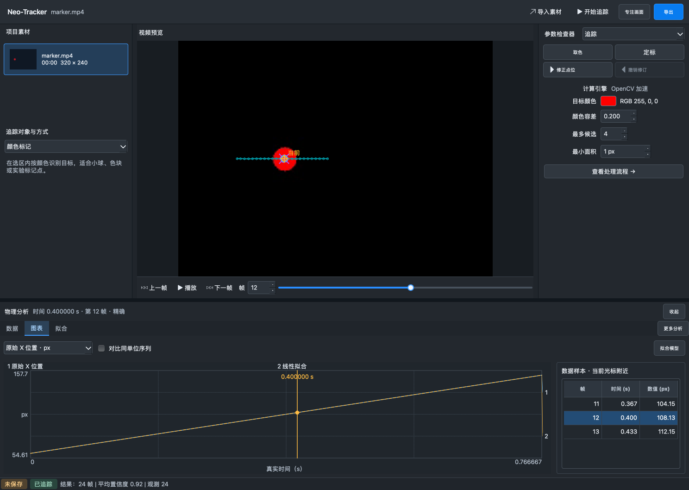

# 第一版深色工作台落地 · 2026-10-05

按用户选中的第一张设计图实现，保留 Python/PySide6、追踪算法、项目格式和原有数据保护。不是网页外壳，也没有引入新的 UI 框架。

## 本机交付

- App：`/Users/leo.xu/Downloads/Neo-Tracker-studio-20261005/Neo-Tracker.app`
- 构建版本：`20261005.1`，Apple Silicon / macOS 27.0，本地 ad-hoc 签名，未做 Developer ID 签名或公证。
- 源码提交：`54ea021`（深色主题、白底图表导出）及 `34349a6`（工作台布局、上下文命令、数据联动）。
- 原有下载目录和主工作区未覆盖；未修改或提交两个已有的 macOS accessibility 诊断脚本。

## 使用变化

顶部保留导入、追踪/取消、专注画面和统一导出。打开/保存仍在原生“文件”菜单，也可在右侧选择“素材”。左侧管理素材缩略图和追踪方式；右侧切换定标、追踪、检查等参数。底部全宽图表与附近三行样本共享同一真实时间选择，更多分析入口放入菜单。

默认只显示选中的物理量，勾选后可对比相同单位序列。改变比较显示不会误丢当前主序列的拟合层。PNG 图表仍导出为白底，CSV/NPZ 和项目数据不随视觉样式改变。

## 验证与证据

- `targeted-tests.log`：48 项针对性测试通过；另一个新增的同主序列拟合保留测试通过。
- 五项窗口/字体/焦点回归检查和十三项动作/来源复核/附近样本检查通过。
- `bundle-smoke.json`：下载目录中的真实 App 完成原生 Cocoa 窗口、隔离视频探测/预览/追踪、24 帧位置/时间、ROI 取消、拟合、CSV/NPZ/Markdown 导出、项目保存及重开一致性检查。
- `bundle-smoke.png`：1488 × 1058；`bundle-compact.png`：1024 × 768。Retina 截图已按 1x 逻辑像素归一化。
- `selected-a.png`：用户选中的设计图。完整对照结论在根目录 `design-qa.md`。

测试视频是临时生成的红色标记点，不是用户实验原件。截图数值是真实计算的合成测试结果，不是测量准确性证据。没有重复全量历史验收，也没有访问 Photos、修改系统安全设置或扫描 App 的原生辅助功能树。

